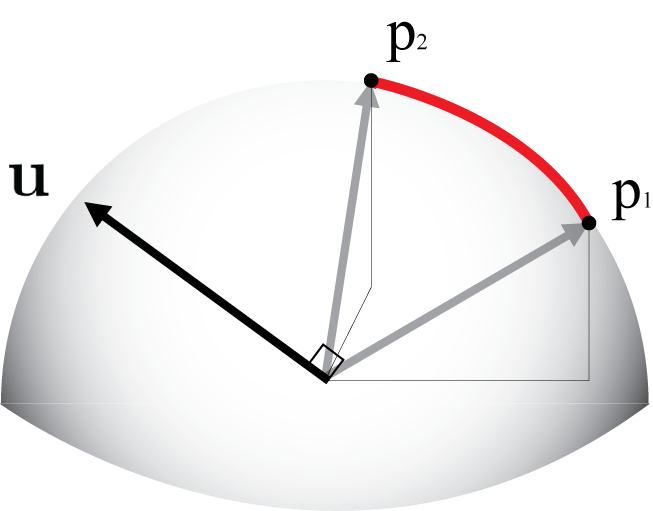
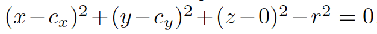
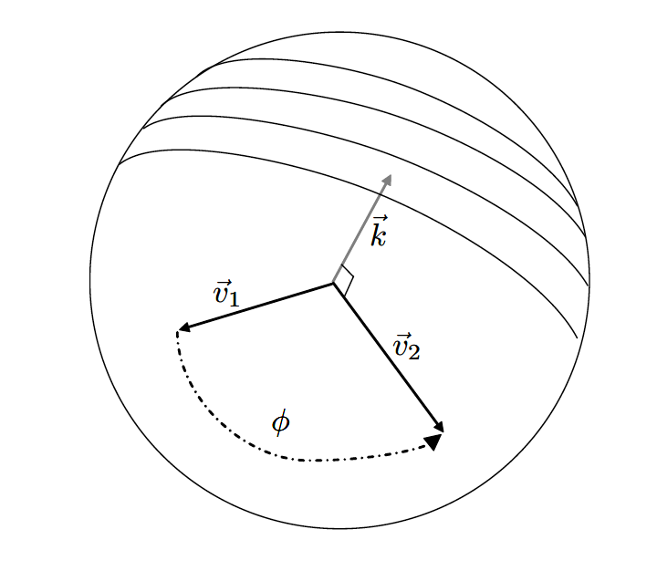
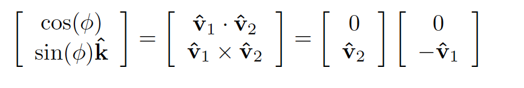

# Trackball and Arcball



## Introduction
  
### Trackball
* Feel like moving a physical sphere in space.
* Path dependent.
  * The final rotation depends on rotations in between. For example, if we moves the mouse from p1 to p2, and then from p2 to p3, the final rotation will be different from the result of moving the mouse directly from p1 to p3.


### Arcball
* Rotates twice as fast as trackball rotates.
* Path independent.
  * If the user starts moving the mouse at one point and finishes at another point, the final rotation will not depend on the path the mouse took in between. 


## Explanation

To perform a rotation transformation, we need to compute the angle and rotation axis.
Suppose there is a sphere surrounding the object (usually much larger than the object), we rotate the sphere in order to rotate the object.

A simple way to do it is to "move" the sphere to screen: think of a 3D space where x-y plane is exaclty on the screen, z-axis coming out of the screen. Thus the z coordinate of the center of the sphere is 0.

The following is a sphere equation:



- (x, y, z) is the screen coordinates of the point where the user has clicked. We already know (x, y), but we need to calculate z.

- (cx, cy, 0) is the screen coordinates of the center of the sphere. We will compute (cx, cy).

- r is the projected radius of the arcball in screen space, which we will calculate.

Our goal is to get (x, y, z) whenever the user clicks at a point on the screen. We will first compute (cx, cy), and then calculate r based on scaling factor. We can get z from the above equation.


## Implementation


1. Convert the coordinates of the center of the sphere in eye space to screen coordinates. (Calculate (cx, cy))
```c
Cvec2 getScreenSpaceCoordFromEyeSpace(const Cvec3& eyeSpaceCoord, const Matrix4& projectionMatrix, int screenWidth, int screenHeight) {
    if (eyeSpaceCoord[2] > -1e-8) {//z should be negative in eye space
        throw string("z > 0");
    }
    Cvec4 p = projectionMatrix * Cvec4(eyeSpaceCoord, 1);
    Cvec3 clippedCoord = Cvec3(p[0], p[1], p[2]) / p[3];
    return Cvec2(clippedCoord[0] * screenWidth / 2.0 + (screenWidth - 1) / 2.0, clippedCoord[1] * screenHeight / 2.0 + (screenHeight - 1) / 2.0);
}
```

2. Calculate the projected radius of the arcball. Note that here z is not the z indicated above. Here z is the z coordinate of the object. What's more, we assume there is only rigid body transform (RBT) in eye space, so we can just start from eye space.
```c
double getScreenToEyeScale(double z, double fovy, int screenHeight) {
    if (z > -1e-8) {
        throw string("z > 0");
    }
    return -(z * tan(fovy * CS175_PI / 360.0)) * 2 / screenHeight;
}
double r = screenWidth / 2;//for example, let the radius of the arcball be half of the screen size
double cr = r / getScreenToEyeScale(entity->getPosition()[2], camera.getFov(), screenHeight);
```

3. Now we can calculate z using the equation.
```c
double x_cx = x - cx;
double y_cy = y - cy;
double z = cr * cr  - x_cx * x_cx - y_cy * y_cy;
z = z < 0 ? 0 : z;
```

4. Now we have (x, y, z) coordinates. We store a previous pointer `prev_pos` and a current pointer `cur_pos` of the the coordinates that the users selected on the sphere in screen space. Then we get v1 and v2 vectors by respectively subtracting two coordinates by the center of the sphere. 



To get the angle of the rotation, apply dot(v1, v2). The rotation axis is obtained by calculating cross product of v1 and v2. By the following formula, we can directly apply two quaternions without calculating dot and cross product of two vectors.



5. Register the callback functions glutMouseFunc and glutMotionFun in main().

```c
Cvec3 prev_pos;
Cvec3 cur_pos;
void mouse(int button, int state, int x, int y) {
     if (button == GLUT_LEFT_BUTTON && state == GLUT_DOWN) {	
     	cur_pos = getPickedPointOnSphereInScreenSpace(entity, x, screenHeight - y);
	prev_pos = cur_pos;					     
     }	
}

void motion(int x, int y) {
     cur_pos = getPickedPointOnSphereInScreenSpace(entity, x, screenHeight - y);
     Cvec2 center = getScreenSpaceCoordFromWorldSpace(entity->getModelMatrix(), camera.getProjectionMatrix(), screenWidth, screenHeight);
     Cvec3 c(center, 0);
     Cvec3 v1 = normalize(prev_pos - c);
     Cvec3 v2 = normalize(cur_pos - c);
     
     Quat q1(0, v2);
     Quat q2(0, -v1);
    
     Quat q = q1 * q2;
     entity->rotate(q);//rotate the object
}
//main
glutMouseFunc(mouse);
glutMotionFunc(motion);
```


## Reference
- Foundation of 3D Computer Graphics. - Steven J. Gortler

## TODO
1. Add source code demo.
