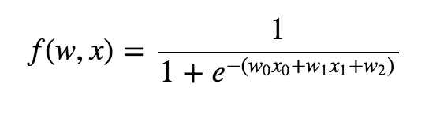
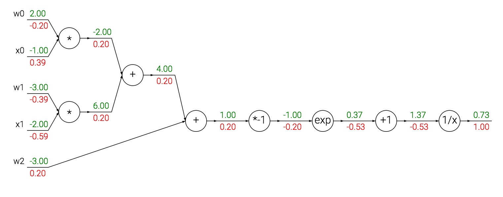
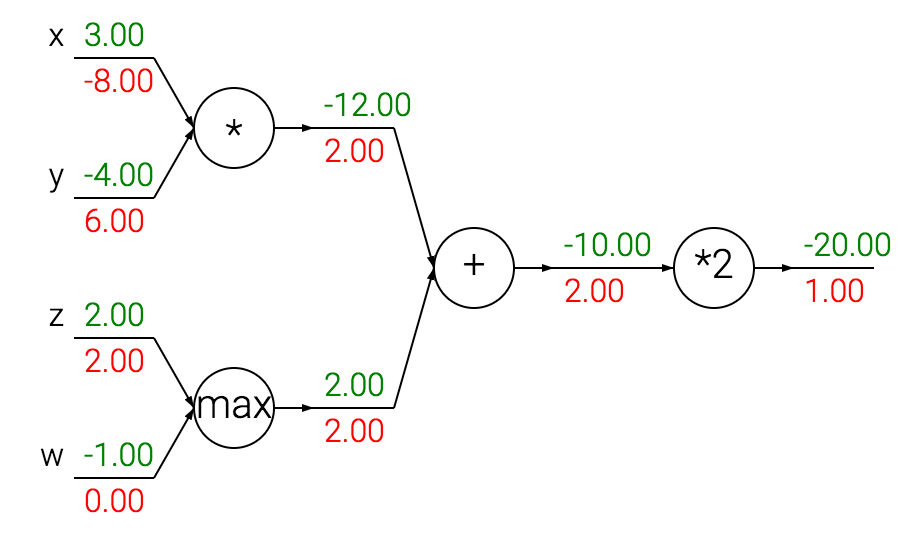

# Backpropagation

**Contents**
* Simple expressions and interpretation of the gradient
* Compound expressions with chain rule; backpropagation
* Sigmoid example; Staged computation
* Patterns in backward flow
* Gradients for vectorized operations

## Simple expressions and interpretation of the gradient

### Multiplication

        f(x, y) = xy            ->           df/dx = y    df/dy = x

* The derivative on each variable tells you the sensitivity of the whole expression on its value.
* the gradient **df** is the vector of partial derivatives, so df = [df/dx, df/dy] = [y, x] fro the above expression.

### Addition

        f(x, y) = x + y        ->            df/dx = 1      df/dy = 1

### Max
        f(x, y) = max(x, y)    ->            df/dx = 1 (x >= y)     df/dy = 1 (y >= x)

For example, x = 4, y = 2, max(4,2) = 4, so the function is not sensitive to the setting of **y**.


## Compound expressions with chain rule

> The **chain rule**: "chain: the gradient expressions by multiplication: df/dx = df/dq * dq/dx

Consider a compound expression:    f(x, y, z) = (x + y)z

1. Break it into two expressions: q = x + y and f = qz
2. Compute these expressions separately: dq/dx = 1, dq/dy = 1, df/dq = z, df/dz = q
3. Apply chain rule:
    - df/dx = df/dq * dq/dx = z * 1 = z
    - df/dy = df/dq * dq/dy = z * 1 = z
    - df/dz = q = x + y

```python
# set some inputs
x = -2; y = 5; z = -4

# perform the forward pass
q = x + y # q becomes 3
f = q * z # f becomes -12

# perform the backward pass (backpropagation) in reverse order:
# first backprop through f = q * z
dfdz = q # df/dz = q, so gradient on z becomes 3
dfdq = z # df/dq = z, so gradient on q becomes -4
# now backprop through q = x + y
dfdx = 1.0 * dfdq # dq/dx = 1. And the multiplication here is the chain rule!
dfdy = 1.0 * dfdq # dq/dy = 1
```


* The **forward pass** computes values from inputs to output (show in green)
* The **backward pass** performs backpropagation which starts at then end and recursively applies the chain rule to compute the gradients (show in red).


* For simplicity, write dq instead of df/dq, assuming the gradient is with respect to the final output.


## Sigmoid example



The expression describes a 2D neuron with inputs **x** and weights **w** that uses the *sigmoid activation function*.

The circuit for this 2D neuron: it computes a dot product with the input (w and x) and then its activation is squashed to be in range from 0 to 1.



The code of backpropagation for this neuron:
```python
w = [2,-3,-3] # assume some random weights and data
x = [-1, -2]

# forward pass
dot = w[0]*x[0] + w[1]*x[1] + w[2]
f = 1.0 / (1 + math.exp(-dot)) # sigmoid function

# backward pass through the neuron (backpropagation)
ddot = (1 - f) * f # gradient on dot variable, using the sigmoid gradient derivation
dx = [w[0] * ddot, w[1] * ddot] # backprop into x
dw = [x[0] * ddot, x[1] * ddot, 1.0 * ddot] # backprop into w
# we're done! we have the gradients on the inputs to the circuit
```
Gotcha:
* **staged backpropagation**
    - break down the forward pass into stages that are easily backpropped through. (e.g. here we created an intermedia variable `dot` that holds the dot product between `w` and `x`.
    - Cache forward pass variables
    - Gradients add up at forks.
    

## Patterns in backward flow



- *Sum* distributes gradients equally to all its inputs.
- *Max* routes the gradient to the higher input.
- *Multiply* takes the input activations, swaps them and multiplies by its gradient. (i.e. dx = y * 2 = -8, dy = x * 2 = 6)

Gotcha:
* Note that the **scale** of the data has an effect on the magnitude of the gradient for the weights.


## Gradients for vectorized operations

**Matrix-Matrix multiply gradient**:
```python
# forward pass
W = np.random.randn(5, 10)
X = np.random.randn(10, 3)
D = W.dot(X)

# now suppose we had the gradient on D from above in the circuit
dD = np.random.randn(*D.shape) # same shape as D
dW = dD.dot(X.T) #.T gives the transpose of the matrix
dX = W.T.dot(dD)
```
