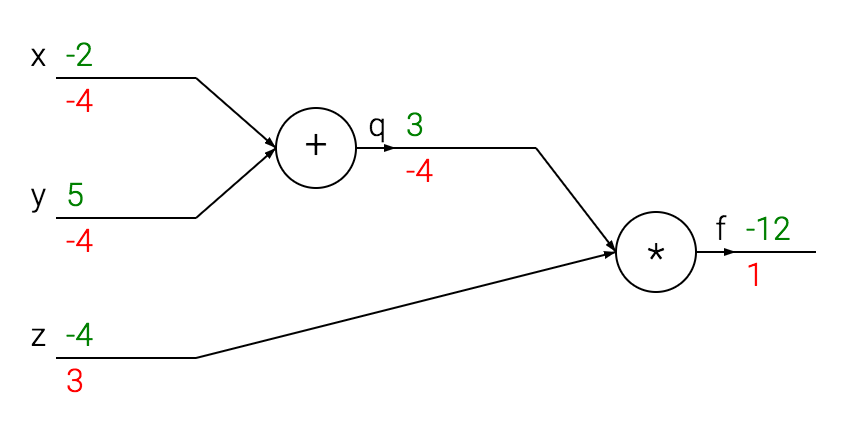

# Backpropagation


## Simple expressions and interpretation of the gradient

### Multiplication

        f(x, y) = xy            ->           df/dx = y    df/dy = x

* The derivative on each variable tells you the sensitivity of the whole expression on its value.
* the gradient **df** is the vector of partial derivatives, so df = [df/dx, df/dy] = [y, x] fro the above expression.

### Addition

        f(x, y) = x + y        ->            df/dx = 1      df/dy = 1

### Max
        f(x, y) = max(x, y)    ->            df/dx = 1 (x >= y)     df/dy = 1 (y >= x)

For example, x = 4, y = 2, max(4,2) = 4, so the function is not sensitive to the setting of **y**.


## Compound expressions with chain rule

> The **chain rule**: "chain: the gradient expressions by multiplication: df/dx = df/dq * dq/dx

Consider a compound expression:    f(x, y, z) = (x + y)z

1. Break it into two expressions: q = x + y and f = qz
2. Compute these expressions separately: dq/dx = 1, dq/dy = 1, df/dq = z, df/dz = q
3. Apply chain rule:
    - df/dx = df/dq * dq/dx = z * 1 = z
    - df/dy = df/dq * dq/dy = z * 1 = z
    - df/dz = q = x + y

```python
# set some inputs
x = -2; y = 5; z = -4

# perform the forward pass
q = x + y # q becomes 3
f = q * z # f becomes -12

# perform the backward pass (backpropagation) in reverse order:
# first backprop through f = q * z
dfdz = q # df/dz = q, so gradient on z becomes 3
dfdq = z # df/dq = z, so gradient on q becomes -4
# now backprop through q = x + y
dfdx = 1.0 * dfdq # dq/dx = 1. And the multiplication here is the chain rule!
dfdy = 1.0 * dfdq # dq/dy = 1
```



* The **forward pass** computes values from inputs to output (show in green)
* The **backward pass** performs backpropagation which starts at then end and recursively applies the chain rule to compute the gradients (show in red).


* For simplicity, write dq instead of df/dq, assuming the gradient is with respect to the final output.


