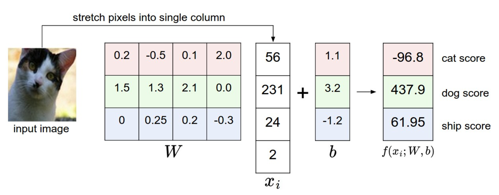
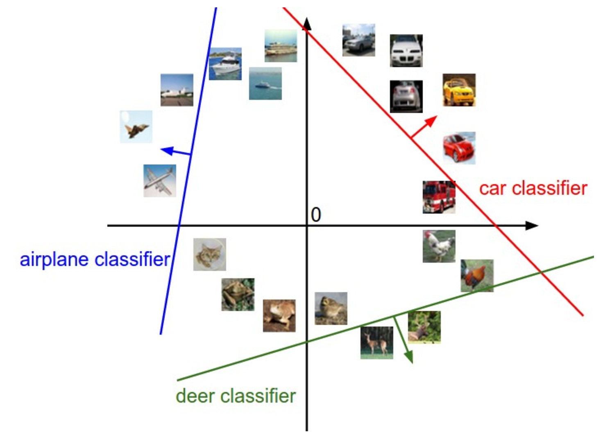
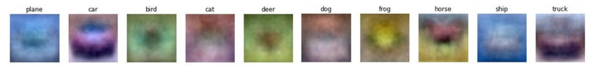
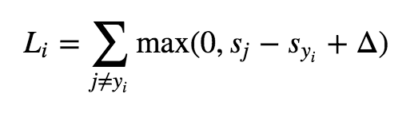

# Linear Classification: Support Vector Machine, Softmax

## Overview
* **Score function**: maps the raw data to class scores
* **Loss function**: quantifies the agreement between the predicted scores and the ground truth labels.

## Score function - Parameterized mapping from images to label scores

Define the score function **f: R^D -> R^K**, 
where D is the dimension of the image (e.g. D = 32x32x3 for a 32x32 RGB image), K is the number of distinct classes.

**Linear classifier** (a linear mapping):
> f(xi, W, b) = Wxi + b

where **xi** ([D x 1])is the ith image with pixels all flattened out into a single column vector of shape, **W** is the matrix ([K x D]), and **b** is the vector ([K x 1]). **W** are often called **weights**, and **b** is called the **bias vector**.

Combine the two sets of parameters **W** and **b** into a single matrix.
> f(xi, W) = Wxi

where **xi** is now [(D + 1) x 1] with the extra dimension holding the contant 1, and **W** is now [K x (D + 1)] with the extra column that represents **b**.

Gotcha:
* The training data is used to learn the parameters **W** and **b**.
* To classify a test image involves a single matrix multiplication and addtion (which can be combined using affine matrix), which much faster than **KNN** that compares a test image to all training images.

## Interpreting a linear classifier

### Analogy of images as high-dimensional points

Imagine squashing the dimensions into only 2 dimension. The geometric interpretation is the as we change one of the rows of **W**, the corresponding line in the pixel space will rotate, and by changing the bias vector **b** will translate the lines.

### Interpretation of linear classifiers as template matching

* Each row of weights **W** corresponds to a template (prototype) for one of the classes.
* The score of each class for an image is obtained by comparing the template with the image using an **inner product (or dot product)** one by one to find the best fit.
* Linear classifier is doing template matching, where the templates are learned from training data.
* Gotcha: 
    - linear classifier is too weak to properly account for different-colored cars, but **neural networks** will be able to perform this task by developing intermediate neurons in its hidden layers that could detect specific car types (e.g. green car facing left, blue car facing front, etc), and neurons on the next layer could combine these into a more accurate car score.
   

#### Image data preprocessing
* Perform normalization of the input features (in this case, every pixel is a feature).
* Center your data by subtracting the mean from every feature (in this case, [0, 255] -> [-127, 127]).
* Scale each input feature to [-1, 1].

## Loss Function - quantifies our unhappiness with predictions on the training set

Ways to define the details of the loss function:

### Multiclass Support Vector Machine (SVM) loss
> the SVM "wants" the correct class for each image to have a score higher than the incorrect classes by some fixed margin delta.

