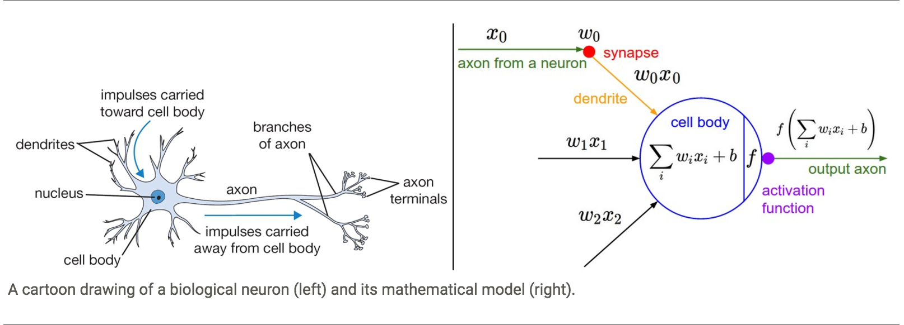
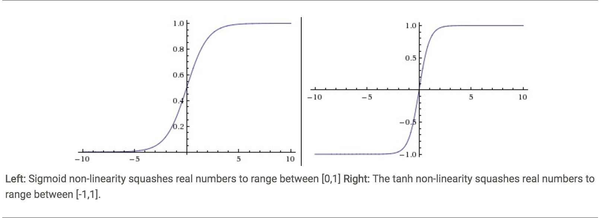
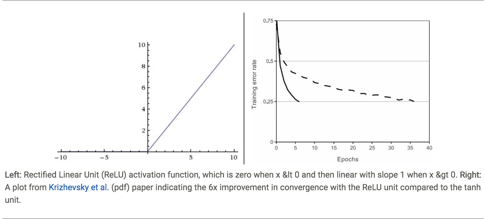
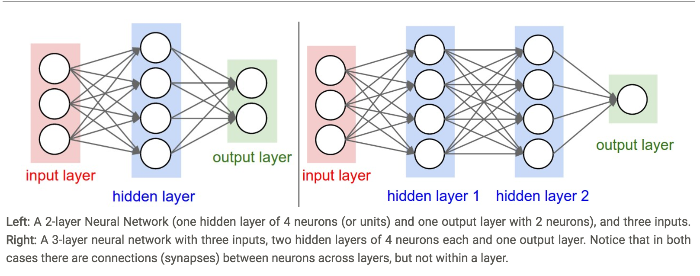
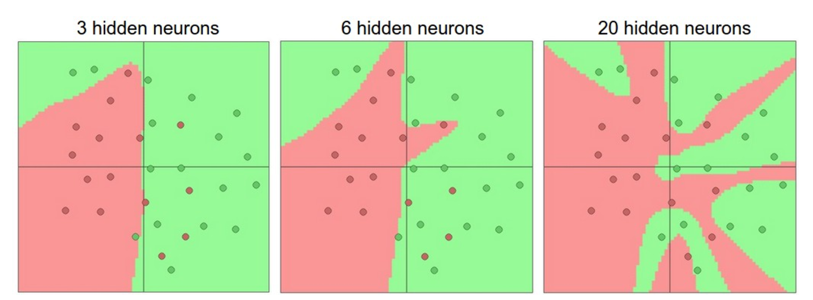
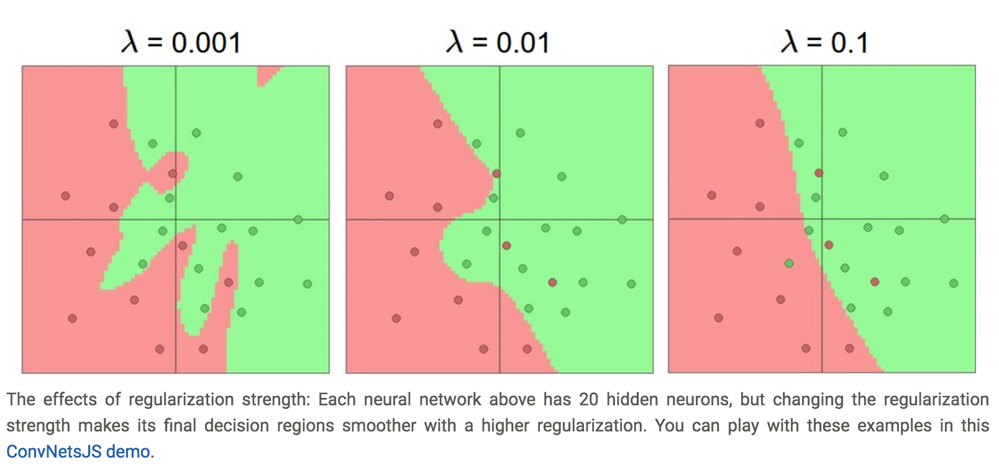

# Neural Networks Part1

**Contents**
* Modeling one neuron
    * Biological Motivation and Connections
    * Single Neuron as a Linear Classifier
    * Commonly used Activation Functions: sigmoid, tanh, ReLU, leaky ReLU, Maxout.
* Neural Network Architectures
    * Layer-wise organization
    * Example feed-forward computation
    * Representational power
    * Setting number of layers and their sizes


## Modeling one neuron

### Biological motivation and connections
> We model the "firing rate" of the neuron with an **activation function f**.



Sample code for forward-propagating a single neuron: each neuron performs a *dot product* with the input and its weights, addes the bias and applies the non-linearity (or activation function), in this case the sigmoid function.

```python
class Neuron(object):
  # ... 
  def forward(inputs):
    """ assume inputs and weights are 1-D numpy arrays and bias is a number """
    cell_body_sum = np.sum(inputs * self.weights) + self.bias
    firing_rate = 1.0 / (1.0 + math.exp(-cell_body_sum)) # sigmoid activation function
    return firing_rate
```

### Single Neuron as a Linear Classifier
> A single neuron can be used to implement a binary classifier.

* **Binary Softmax classifier**
    - we can interpret **sigmoid_func(sum(wixi + b))** to be the possibility of one of the classes **P**. The probability of the other class would be **1 - P**.
* **Binary SVM classifier**
    - we can attach a **max-margin hinge loss** to the output of the neuron and train it to become a binary Support Vector Machine.
* **Regularization interpretation**
    - The regularization loss in both SVM/Softmax cases could be interpreted as *gradual forgetting*.

### Commonly Used Activation Functions


* **Sigmoid**
    - Squashes a real-valued number into range [0, 1].
    - In practice, it is rarely ever used. Two major drawbacks:
        - *Sigmoids saturate and kill gradients*. 
            - If the local gradient is very small, it will "kill" the gradient during *backpropagation*.
            - Avoid large initial weights to prevent neurons saturation.
        - *Sigmoid outputs are not zero-centered*. 
* **Tanh**
    - Squashes a real-valued number into range [-1, 1].
    - In practice, the *tanh non-linearity* is always preferred to the *sigmoid non-linearity*.
        - Like the sigmoid neuron, its activations saturate.
        - Tanh outputs are zero-centered.


* **ReLU** (Rectified Linear Unit)
    - f(x) = max(0, x)
    - Pros and Cons:
        - (+) Greatly accelerate the convergence of stochastic gradient descent compared to the *sigmoid/tanh* functions.
        - (+) Computationally cheap: simply by threasholding a matrix of activations at zero.
        - (-) Fragile during training and can "die" (i.e. neurons never activate across the entire training dataset) **if the learning rate is set too high**. If a large gradient flowing through a ReLU neuron could cause the weights to update (the gradient flowing through the unit will forever be *zero*) in such a way that the neuron will never activate on any data point again.

* **Leaky ReLU**
    - f(x) = ax (x < 0), x(x >= 0), where a is a small constant.
    - This is to fix the "dying ReLU" problem.

* [**Maxout**](http://www-etud.iro.umontreal.ca/~goodfeli/maxout.html)
    - f(x) = max(w1x + b1, w2x + b2)
    - Generalizes the ReLU and its leaky version.


## Neural Network architectures

### Layer-wise Organization
**Neural Networks as neurons in graphs**

Neural networks are modeled as collections of neurons that are connected in an acyclic graph. The most common layer type is the **fully-connected layer** where neurons between two adjacent layers are *fully pairwise connected*, but neurons within a single layer share no connections.

Below are two Neural Network topologies that use a stack of fully-connected layers:


**Naming conventions**
* When we say *N-layer neural network*, we do not count the *input layer*. Therefore, a single-layer nerual network describes a network with no hidden layers (input directly mapped to output).
* A special case of single-layer Neural Networks: logistic regression or SVMs.
* Also called **"Aritifical Neural Networks"** (ANN) or **"Multi-Layer Perceptrons"** (MLP).
* *Neurons* is also called *units*.

**Output layer**
* The output layer neurons mostly do not have an **activation function** (or have a linear identity activation function).
* The last output layer is usually taken to represent:
    - the class scores (e.g. in classification), which are arbitrary real-valued numbers
    - some kind of real-valued target (e.g. in regression).

**Sizing nerual networks**

Two metrics to measure the size of neural networks:

1. the number of neurons.

2. the number of parameters.

For example, for the above example networks:
* The left networks has 4 + 2 = 6 neurons (not counting the inputs), [3 x 4] + [4 x 2] = 20 weights and 4 + 2 = 6 biases, for a total of 26 learnable parameters.
* The right networks has 4 + 4 + 1 = 9 neurons, [3 x 4] + [4 x 4] + [4 x 1] = 32 weights and 4 + 4 + 1 = 9 biases, for a total of 41 learnable parameters.


### Example feed-forward computation
*Repeated matrix multiplications interwoven with activation function*.
```python
# forward-pass of a 3-layer neural network:
f = lambda x: 1.0/(1.0 + np.exp(-x)) # activation function (use sigmoid)
x = np.random.randn(3, 1) # random input vector of three numbers (3x1)
h1 = f(np.dot(W1, x) + b1) # calculate first hidden layer activations (4x1)
h2 = f(np.dot(W2, h1) + b2) # calculate second hidden layer activations (4x1)
out = np.dot(W3, h2) + b3 # output neuron (1x1)
```
> The forward pass of a fully-connected layer corresponds to one matrix multiplication followed by a bias offset and an activation function.

### Representational power
Neural Networks with at least one hidden layer are *universal approximators*. (i.e. The neural network can approximate any continuous function.)

### Setting number of layers and their sizes


We can see from the above diagram that Neural Networks with more neurons can express more complicated functions.
* **Overfitting** occurs when a model with high capacity fits the noise (**outliers**) in the data instead of the underlying relationship.
    - Ways to prevent overfitting: L2 regularization, dropout, input noise, etc.



Gotcha:
* Should not be using smaller networks because you are afraid of *overfitting*. Instead, use as big of a neural network as your computational budget allows, and use other regularization techniques to control overfitting.

